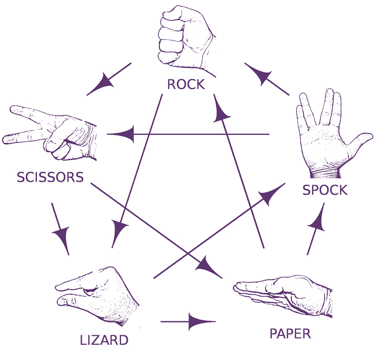

# OpenCV-Rock-Paper-Scissors-Lizard-Spock
This project extends the traditional game of rock paper scissors to 5 hand signs, featuring AI and computer vision. It leverages a Random Forest classifier and OpenCV for real-time hand sign recognition and winner determination.

## Random Forest Classifier
Random Forest is chosen for its robustness and ability to handle a large number of input variables. It creates a 'forest' of decision trees, each trained on a random subset of the training data. The final prediction is made by aggregating the predictions of all individual trees, reducing overfitting and improving accuracy.

## OpenCV
OpenCV (Open Source Computer Vision Library) is used for real-time image processing. It captures video from the webcam, processes the frames to detect and recognize hand signs, and feeds the processed data into the Random Forest classifier. OpenCV provides various tools for image processing, such as contour detection, image filtering, and feature extraction, which are essential for accurately identifying hand signs.


# How to Play
1. Start the game by pressing the 's' key.
2. Show your hand sign to the camera.
3. The AI will also choose a hand sign.
4. The winner will be displayed on the screen.

# Rules

https://images.app.goo.gl/eg7f5pxQUEsiCEXAA


The rules of the game are as follows:
- Rock crushes Scissors
- Scissors cuts Paper
- Paper covers Rock
- Rock crushes Lizard
- Lizard poisons Spock
- Spock smashes Scissors
- Scissors decapitates Lizard
- Lizard eats Paper
- Paper disproves Spock
- Spock vaporizes Rock


# Adding your own training data
1. Activate training mode by pressing the 't' key.
2. Select a training slot (0-9) by pressing the corresponding number key.
    - Training slots 0-4 correspond to rock, paper, scissors, lizard, and spock respectively.
3. Show your hand sign to the camera and press 'c' to capture the data.
4. The captured data will be saved to `./model/training/training_data.csv`.
5. Execute `handSignClassifier.ipynb` to train the model with the captured data.

# Training data features
The training data is stored in a CSV file located at `./model/training/training_data.csv`. Each row in the CSV file represents a single training example and contains the following fields:

1. **Label**: An integer representing the hand sign (0-4) where:
    - 0: Rock
    - 1: Paper
    - 2: Scissors
    - 3: Lizard
    - 4: Spock

2. **Handedness**: A string indicating whether the hand is "Left" or "Right".

3. **Landmarks**: A list of normalized 3D coordinates (x, y, z) for each hand landmark. The landmarks are normalized based on the bounding box of the hand to ensure consistency across different hand sizes and positions.

Example of a single row in the CSV file:
```csv
0,Right,"[[0.6851851851851852, 1.0, 0.0], [0.35185185185185186, 0.8428571428571429, -0.11428571428571428], ...]"
